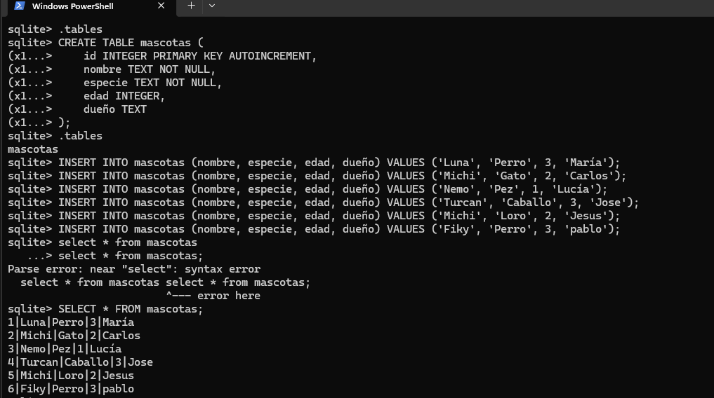
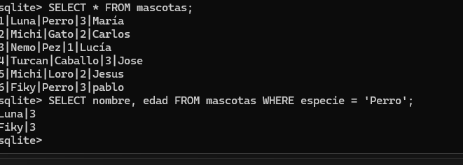
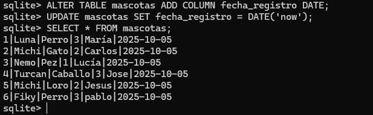
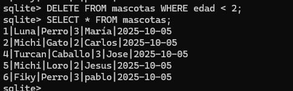

# Inserta al menos 3 mascotas más de distintas especies.

# Crea una consulta que muestre solo los nombres y edades de los perros.

# Modifica la tabla para añadir un nuevo campo fecha_registro de tipo DATE.
# Inserta la fecha de registro en las nuevas mascotas.

# Elimina todas las mascotas con edad menor a 2 años.
